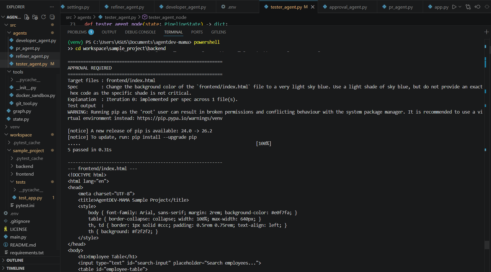
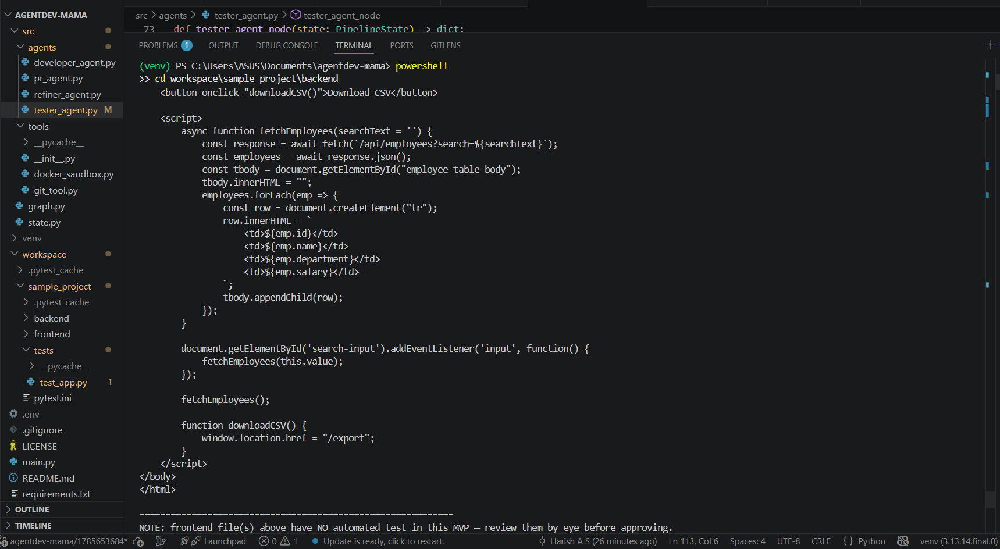
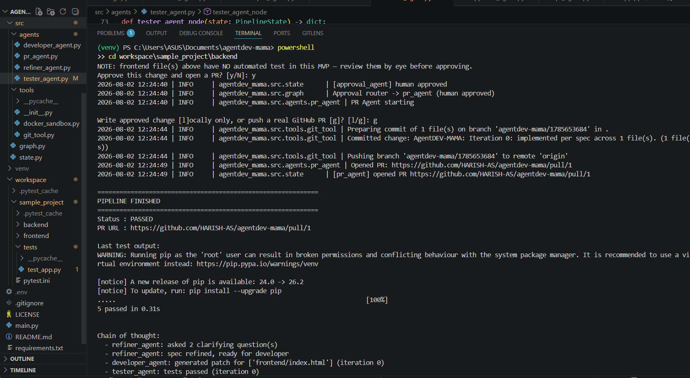
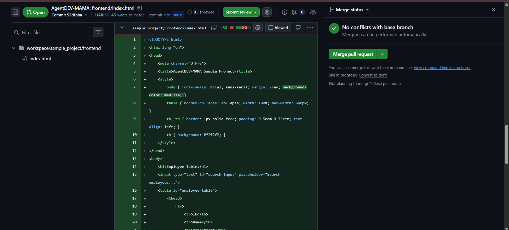

# Workflow: A Real Run, End to End

This walks through an actual completed run of AgentDEV-MAMA, from prompt to merged pull request, using real terminal output and screenshots — not a hypothetical example.

## 1. Start the pipeline

```powershell
python main.py
```

You're prompted for a plain-English request and the files it should touch:

```
Describe the change you want: add a download button that exports the table as CSV
Target files, comma-separated: backend/app.py, frontend/index.html
```

## 2. Refiner Agent clarifies

The Refiner Agent doesn't yet see the actual file contents (a known limitation — see `docs/agents.md`), so for anything not fully spelled out in the prompt, it asks directly in the terminal:

```
[Refiner Agent] Which file should the download button be added to?
> backend/app.py, frontend/index.html

[Refiner Agent] What is the expected behavior when the button is clicked?
> export the table data as a csv file
```

Answers get folded into a `refined_prompt`, and the pipeline moves to the Developer Agent.

## 3. Developer Agent generates the patch

Runs against Ollama locally, producing coordinated changes across both target files — the backend route and the frontend button/JS calling it, kept consistent (same URL on both sides).

## 4. Tester Agent verifies it for real

```
Running tests in Docker sandbox (image=python:3.11-slim)
Docker test run finished: exit_code=0 passed=True
```

Real pytest execution inside a disposable container — not a simulated result. On an earlier run in this project, this step caught a genuine bug: the Developer Agent had used `io.StringIO()` without importing `io`, which would have 500'd the moment anyone clicked the button in a browser. The existing tests didn't cover `/export` at the time, so a new test was added specifically to catch that class of bug going forward.

## 5. Approval Agent — the human checkpoint

Every patched file is printed in full, along with the test output, before anything can proceed:


*Full patch review at the terminal before typing y to approve.*

This is the point where scope creep needs to be caught. In one run, asking only for a background-color change resulted in the model also adding an unrequested (and non-functional, since the backend was never updated to match) search box — caught after the fact by reviewing the diff, not automatically.

## 6. PR Agent — local write or real GitHub PR

After approval, a runtime choice:

```
Write approved change [l]ocally only, or push a real GitHub PR [g]? [l/g]:
```

**Local-only** writes the files straight into `workspace/sample_project/`, no git involved — useful for quick iteration without touching version control at all.

**GitHub mode** commits to a new branch, pushes it, and opens a real pull request via PyGithub:

```
Committed change: AgentDEV-MAMA: Iteration 0: implemented per spec across 1 file(s).
Pushing branch 'agentdev-mama/1785653684' to remote 'origin'
Opened PR: https://github.com/HARISH-AS/agentdev-mama/pull/1
```


*The resulting PR, showing the actual generated diff — in this case, the background-color change.*

## 7. Reviewing and merging

The PR sits open on GitHub exactly like any human-authored PR — reviewable, commentable, mergeable (or closable) through the normal GitHub UI. The pipeline does not auto-merge; that's a deliberate, separate manual step.



## 8. Final summary

```
============================================================
PIPELINE FINISHED
============================================================
Status : PASSED
PR URL : https://github.com/HARISH-AS/agentdev-mama/pull/1

Chain of thought:
  - refiner_agent: asked 2 clarifying question(s)
  - refiner_agent: spec refined, ready for developer
  - developer_agent: generated patch for [...] (iteration 0)
  - tester_agent: tests passed (iteration 0)
  - approval_agent: human approved
  - pr_agent: opened PR https://github.com/HARISH-AS/agentdev-mama/pull/1
```

`chain_of_thought` gives a one-glance summary of the whole run without needing to scroll back through timestamped logs.

## What a failed run looks like

Not every run passes on the first try — and that's the retry loop working as intended, not a malfunction. One run asked for a background-color change targeting only `frontend/index.html`; the Tester Agent initially failed every attempt with `ModuleNotFoundError: No module named 'app'`, because the sandbox only ever received files targeted *that specific run* — the backend, untouched, was never copied in. Fixed by always including unpatched backend files in the sandbox regardless of what was targeted (see `docs/agents.md`, Tester Agent section, for the detail).


*A run hitting max_iterations and stopping cleanly at STATUS: FAILED, rather than looping forever or crashing.*
